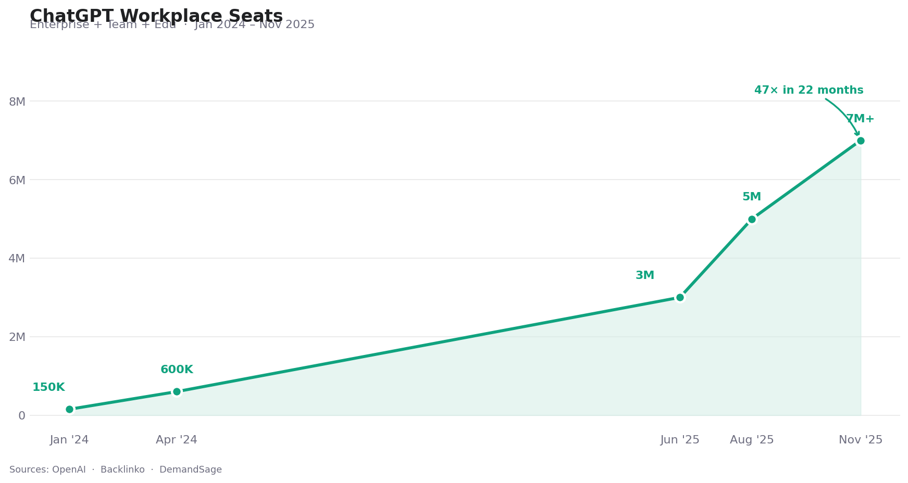

# Bring Your AI Memory When You Switch Jobs — And Why It's Harder Than It Looks

*In January 2024, ChatGPT Team launched with 150,000 enterprise users. By November 2025, there were 7 million+ workplace seats. Millions of professionals are now facing a problem no one planned for: what happens to your AI memory when you change jobs?*

---

ChatGPT Team launched in January 2024. Eighteen months later, OpenAI reported over 7 million paid workplace seats — a 47× increase. Today, 92% of Fortune 500 companies use ChatGPT, and 28% of all employed adults use it at work, most of them four or more days a week.

*ChatGPT's enterprise and team seat growth, Jan 2024 – Nov 2025. Sources: OpenAI, Backlinko, DemandSage*

Behind those numbers is something less visible: each of those 7 million users has been building something. Not just a usage history — an AI that increasingly understands how they think, how they write, what they care about, what level of detail they need. OpenAI's own research found that regular AI users save 40–60 minutes per day. That productivity gain isn't just about the model's capability. A large part of it is accumulated context — the AI knowing you.

Here's what no one talks about in the employee handbook: **that context belongs to the company account, not to you.**

When you change jobs, it stays behind.

---

## The New Gap in Professional Portability

*ChatGPT Team accounts belong to the employer — and so does the AI collaboration context built inside them. (Source: TechCrunch / Getty Images)*

Traditional employment exits had a clear logic: your judgment and experience are yours; the company's files and IP are theirs. That distinction held up reasonably well for decades.

AI has created a third category that doesn't map cleanly to either:

**The AI's model of you — built from your thinking, your iterations, your professional reasoning — stored inside an account the company controls.**

This isn't company IP. It emerged from your mind, your expertise, your effort applied over hundreds of conversations. But it exists in infrastructure that belongs to someone else. When the account closes, it closes with it.

For someone who's used AI heavily for a year, the switching cost isn't just learning a new tool. It's losing the invisible layer of context that made the tool useful — and spending weeks rebuilding it from scratch at a new employer.

---

## How the Official Tool Works

*Anthropic's memory import tool, launched March 2026, is the industry's first serious attempt at addressing AI context portability. (Source: AwesomeAgents)*

Good news: the AI industry has started to address this problem. On March 2, 2026, Anthropic launched `claude.com/import-memory` — a tool that lets you bring your AI memory from ChatGPT, Gemini, or Copilot into Claude.

The process is designed to be simple:

1. Copy a prompt from Claude's import page
2. Paste it into your current AI — it responds with a structured summary of what it knows about you
3. Paste that summary into Claude's memory settings
4. Within 24 hours, Claude incorporates the context

No browser extension to install. No account linking. No technical setup. Users who've tried it reported completing the process in under five minutes, and early reactions praised the low friction.

For professionals planning a deliberate switch to Claude, it's a genuine head start. Your stated preferences, communication style, project context, and professional details carry over without having to re-explain everything from scratch.

**What transfers well:**
- Tone and format instructions ("be concise," "use bullet points," "explain at a senior developer level")
- Personal and professional background you've explicitly shared
- Project names, goals, and recurring topics you've discussed

**The privacy angle is also worth noting:** Claude's memory is encrypted and not used to train models — a meaningful distinction for professionals careful about where their work context ends up.

---

## What the Tool Captures — And Where It Stops

Understanding what the tool *doesn't* do is equally important — especially if you're counting on it to preserve months of invested context.

**It transfers stored memory snippets, not conversation history.**

This is the central constraint. AI platforms save "memory" as distilled highlights — facts and preferences the AI has explicitly noted. The import tool moves these highlights. What it doesn't move is the accumulated context that builds through actual conversation: the iterative refinements, the implicit patterns, the evolving understanding of your domain and reasoning style.

If you've been using ChatGPT for a year, most of what makes it useful for you lives in your conversation history — not in a memory settings page. That history stays on ChatGPT.

Beyond this core limitation, several practical friction points emerged from early users:

**The 24-hour delay.** Memory updates process overnight, not instantly. You import your context and wait a day before it takes effect — manageable for a planned migration, but potentially frustrating if you expected immediate continuity.

**It's a one-time snapshot.** After you complete the import, there's no ongoing connection between platforms. Future usage on your old platform doesn't automatically update Claude's memory. You'd need to repeat the process manually to capture new context.

**The source data may be incomplete.** ChatGPT's memory is only as complete as what it chose to save — which may not reflect your most important professional context, and may occasionally include inaccurate assumptions about you. Anthropic recommends reviewing imported memories before relying on them.

**Export limitations from other platforms.** Testing by multiple users found that ChatGPT appears to limit how much it exports through this workflow, with some users receiving minimal output despite months of usage. The tool's effectiveness depends on what the source platform is willing to share.

**Selective incorporation.** Claude's memory system is designed around professional context and may quietly omit personal details that don't relate to work tasks. If you'd trained your previous AI on broader personal context, some of that may not carry over.

---

## The Deeper Issue for Job-Switchers Specifically

For someone switching platforms by choice, the tool's limitations are manageable. You plan the migration, you expect some re-onboarding.

Job-switching is different. You don't choose the timing, and you typically don't have advance notice that you'll lose access. The company account disappears when HR processes your departure — not when you've had a chance to carefully export and review your context.

The company account problem also predates any migration tool: what the official tool addresses is moving context *between AI platforms*. It doesn't address the more common scenario, which is that the context was built inside a *company-owned account* on the same platform you'll use at your next job.

If you've spent a year building AI collaboration context on ChatGPT via your company's Team account, and your new employer also uses ChatGPT — you still start from scratch. The migration tool only helps if you're switching platforms, and it only works with what was in your personal memory settings, not the company account's history.

---

## What Portable AI Memory Actually Requires

*Memdex is a browser extension that captures your AI collaboration context continuously — stored in your personal account, independent of any employer or platform. (Source: memdex.ai)*

The official migration tool is a useful bridge for deliberate platform switches. For professionals who want to protect their AI collaboration context as career capital — before a job change, not during one — the approach needs to be different.

[Memdex](https://memdex.ai) is a browser extension that works differently at the structural level:

**It captures continuously, not on-demand.** While you work with ChatGPT, Claude, Gemini, or other AI tools, Memdex observes in the background — identifying your patterns, terminology, decision frameworks, and working style as they emerge from actual usage. Nothing needs to be explicitly saved.

**It stores in your personal account, not your employer's.** Your Memdex context is tied to your personal account, not to any company subscription. When you leave a job, your context leaves with you — because it was never in the company account to begin with.

**It works across platforms from the start.** When you start a new role with different AI tools, your accumulated context is already there. You don't need a migration step because your memory was always portable.

**It captures ongoing context, not just saved snippets.** The gap the official tool revealed — continuous vs. stored context — is what Memdex is designed around. The context that builds through regular usage is what it captures, not just the highlights that get formally saved.

---

## Practical Steps You Can Take Now

Whether or not you install anything, there are actions that protect your AI context as you build it:

**Know which account your context lives in.** If your employer provides AI tools, the context you build there belongs to that account. Be deliberate about what valuable professional thinking you're developing inside platforms you don't control.

**Export what you can, periodically.** Both ChatGPT and Claude offer data export options. They don't capture everything, but they capture something. Don't wait until you're giving notice.

**Use personal accounts for personal professional development.** Your own AI subscriptions, connected to your personal accounts, create context you own. Use employer tools for employer work; use personal tools for professional development you intend to keep.

**Start capturing context independently.** This is where a tool like Memdex changes the equation — not as a last-minute migration solution, but as a continuous layer running from the start.

---

## A Different Way to Think About It

For most of professional history, career capital was cognitive: what you know, how you think, the judgment you've developed from experience. This was inherently portable. You carried your expertise with you when you changed jobs.

AI collaboration is creating a new form of professional capital: the accumulated context between you and your AI tools. This is also a product of your expertise — but unlike knowledge, it can exist in infrastructure you don't control.

The professionals who recognize this early — who treat their AI collaboration context as career capital to be maintained and owned, not left in employer accounts — will have an advantage. They'll arrive at new roles with continuity. They'll capture the upside of every new model release. They'll be resilient to platform outages and policy changes.

Your expertise is portable by nature. Your AI memory can be too — but only if you plan for it.

---

**[Start building your portable AI memory with Memdex →](https://memdex.ai)**

*Browser extension for Chrome, Edge, and Firefox. Works alongside ChatGPT, Claude, Gemini, and other AI platforms.*
