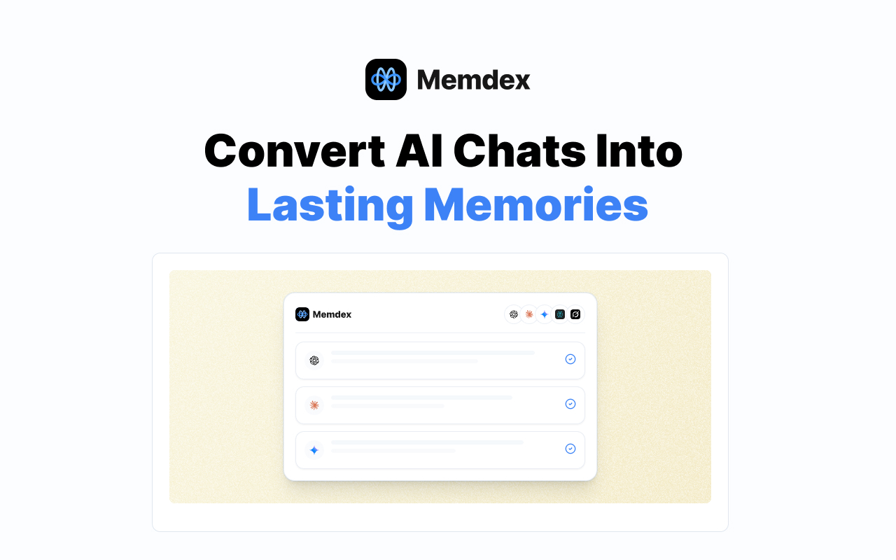
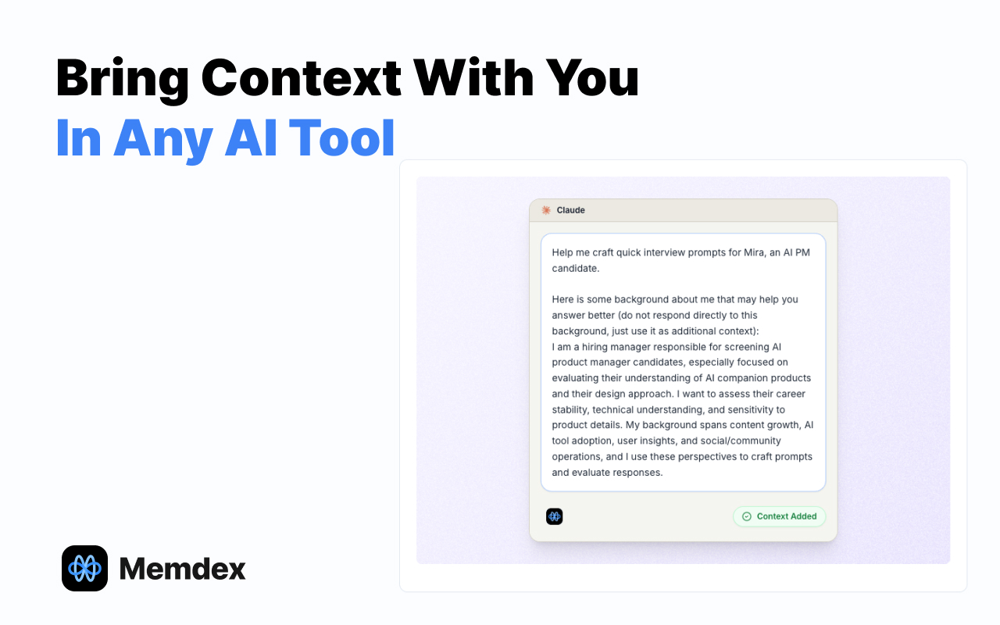

<!--

-->

# How to export ChatGPT Team Account Memory: What You Lose When You Leave Your Job

*March 2026 · 7 min read*

---

ChatGPT Team launched in January 2024. By November 2025, OpenAI reported over 7 million paid workplace seats — a 47× increase in under two years. Today, 92% of Fortune 500 companies use ChatGPT, and 28% of all employed adults use it at work, most of them four or more days a week.

*ChatGPT's enterprise and team seat growth, Jan 2024 – Nov 2025. Sources: OpenAI, Backlinko, DemandSage*

Behind those numbers is something less visible: each of those 7 million users has been building something. Not just a usage history — an AI that increasingly understands how they think, how they write, what they care about. OpenAI's own research found that regular AI users save 40–60 minutes per day. Much of that gain isn't raw model capability — it's the AI *knowing you*.

Here's what no one writes into the employee handbook: **that context belongs to the company account, not to you.**

When you change jobs, it stays behind.

---

## A New Kind of Professional Asset — Without Ownership

Traditional employment exits had a clear logic: your judgment and experience belong to you; the company's files, IP, and data belong to them. That boundary held up well for decades.

AI has created a third category that doesn't map cleanly to either side.

*ChatGPT Team accounts are owned by the employer — and so is all the AI context built inside them.*

When you use your company's ChatGPT Team account, everything the AI learns about you — your thinking style, your project vocabulary, your preferred level of detail, your judgment frameworks — lives inside that employer-managed workspace. It was built from *your* reasoning and expertise. But it lives in infrastructure someone else controls.

When the account closes, it closes with it. OpenAI's own documentation is clear: when a member is removed from a workspace, their access to that data ends. There is no personal export right for individual contributors in most Team and Enterprise configurations.

This creates what we might call a **hidden offboarding cost** — one that didn't exist before AI became a daily work tool, and one that virtually no company currently accounts for.

---

## Why "Just Export Your Data" Doesn't Solve It

A reasonable response is: can't you just export your ChatGPT conversations before you leave?

In most company accounts: no. Data export rights belong to the workspace admin. Individual users generally cannot export conversation data from employer-managed ChatGPT Team accounts. Check with IT, but don't count on it.

Even where export is possible, there's a deeper problem. Conversation logs are not the same as the AI's *model of you*.

What makes months of AI collaboration genuinely productive isn't the raw transcripts — it's the implicit understanding that accumulates through hundreds of interactions. The AI learning that you always want the trade-offs spelled out. That you think in systems. That "brief summary" for you means three sentences, not three paragraphs. That vocabulary. That calibration. That's what's hard to reconstruct, and it doesn't live in an exportable file.

---

## What the Industry's New Migration Tools Do — And Don't — Address

*Anthropic's memory import tool, launched March 2026 — a genuine step forward for voluntary platform switching. (Source: Anthropic)*

On March 2, 2026, Anthropic launched `claude.com/import-memory`: a tool that lets you paste a prompt into ChatGPT, get a structured export of your saved memory, and import it into Claude. No technical setup, free for all users, takes about five minutes.

It's the right tool for a specific problem: deliberately switching from ChatGPT to Claude, and wanting your explicit preferences to carry over.

It's the wrong tool for the job-change problem, for two reasons:

**First**, it only imports your *personal* ChatGPT memory — the data tied to your personal OpenAI account. If your context was built inside a company ChatGPT Team account, there's nothing for it to export. The company account and your personal account are separate; the migration tool can only reach the latter.

**Second**, it only captures saved memory snippets — the explicit preferences ChatGPT had formally noted. The continuous context built through months of actual conversation doesn't transfer. You're carrying over the notes, not the understanding.

For job-switchers specifically, the official tool addresses a scenario that doesn't apply to them: someone who has rich personal ChatGPT memory, and wants to move to Claude. Most knowledge workers at companies with ChatGPT Team accounts are building context in the *company* account, not a personal one.

---

## What Portable AI Memory Actually Looks Like

*Memdex captures your AI collaboration context across platforms and stores it in your personal account — not your employer's. (Source: Memdex)*

The job-change problem requires a different structural approach: AI memory that is never in the company account to begin with.

[Memdex](https://memdex.ai) is a browser extension designed around this premise. While you work with ChatGPT, Claude, Gemini, or other AI tools, Memdex runs in the background — identifying your patterns, terminology, decision frameworks, and working style as they emerge from actual usage. This context is stored in your *personal* Memdex account, not in the platform's infrastructure, and not in your employer's workspace.

*When you open any AI tool — at your current company, your next one, or a new model entirely — Memdex injects your personal context automatically. (Source: Memdex)*

The practical difference at job-change time:

- **With company accounts only:** You leave, the account closes, you rebuild from scratch at the new employer.
- **With Memdex running:** You leave, your Memdex context travels with you, and you arrive at the new role with your full AI collaboration history intact — regardless of which AI platforms the new company uses.

The same holds for voluntary platform switches. When a better model releases and you want to try it, your context is already there.

---

## Steps to Protect Your AI Context Before Your Next Job Change

You don't need to wait for an offboarding event. Several practical steps apply now:

**Know which account your context lives in.** If your employer provides AI tools, the context you build there belongs to that account. Be deliberate about where you're developing professional AI context that you intend to keep.

**Use personal accounts for personal professional development.** Your own Claude or ChatGPT subscription, connected to your personal email, creates context you own. Use employer tools for employer work; use personal accounts for skills and patterns you're developing for your career.

**Export what you can, periodically — not the day you resign.** Both ChatGPT and Claude offer data export options for personal accounts. They don't capture everything, but they capture something. Do this quarterly.

**Start capturing context independently from the start.** This is where a tool like Memdex changes the equation. Not as a last-minute migration step, but as a continuous background layer that ensures your AI collaboration history grows in your account, not the platform's.

---

## The Compounding Value Problem

*New frontier models arrive every few weeks. Users with portable memory capture each upgrade — users locked into one platform's account start over every time they switch.*

The SOTA chart above shows something relevant beyond job-switching: AI capability is a moving target, and it's moving fast. GPT-5, Claude Opus 4.5, Gemini 3 Pro — each represents a meaningful jump in what AI can do for professional work.

The professionals who benefit most from each new release are the ones whose accumulated context can travel forward with them. They don't have to choose between the familiar model (where they have context) and the better model (where they'd start fresh). Their context moves, their productivity compounds.

The professionals who rebuild from scratch at every transition — every job change, every platform switch, every model upgrade — are paying a tax that accumulates over time. It's invisible until you calculate it: weeks of re-onboarding across a career, during every transition period when you're already trying to prove yourself somewhere new.

---

## Frequently Asked Questions

**What happens to my ChatGPT memory when I leave my company?**
You lose access when you're removed from the workspace. The memory does not transfer to your personal account. You start from scratch.

**Can I export my conversation history from a company ChatGPT account?**
In most configurations, no. Data export rights belong to workspace admins, not individual users. Check with IT before your last day, but don't count on it.

**Does Claude's import tool help in this scenario?**
Only if you also have a personal ChatGPT account with saved memories. It cannot reach content inside a company-managed workspace.

**How far in advance should I start protecting my AI context?**
Now. The best time is before you start building context you'd want to keep. The second-best time is today.

---

Your expertise is portable by nature — you've always carried your experience with you when you changed jobs. Your AI memory should work the same way. Right now, for most professionals, it doesn't.

The fix isn't complicated. It's structural: build your AI collaboration context in an account you control, from the start.

---

**[Start building your portable AI memory with Memdex →](https://memdex.ai)**

*Browser extension for Chrome, Edge, and Firefox. Works alongside ChatGPT, Claude, Gemini, and other AI platforms.*
